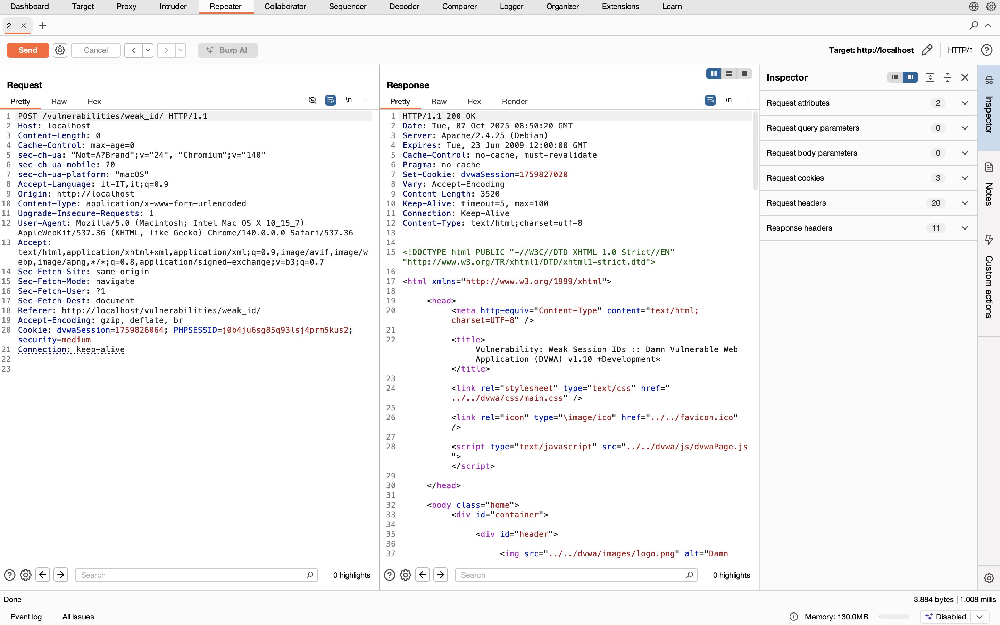

# Security Engineering - Week 4 exercises

## Task 3: BurpSuite

### Subtask 1: Intercepting

In the screenshot below you can see the listing of the last POST and GET requests with timestamps and port, and the entire edited POST request in raw format. In particular, I modified the User-Agent by typing my name and an household item: "Martina Vianello + lamp". 

### Subtask 2: Repeater

A new cookie called dvwaSession is created every time the "Generate" button is pressed. Using the repeater functionality I could see that everytime the request was sent again the value of the cookie was re-generated exploiting the time the request was sent. I can understand this by looking at the original POST request where the dvwaSession cookie has a certain value and at the response that I got after sending the request again (after some time), where the value of the cookie is simply incremented. You can see this in the screenshot below where both the request and the response are visible. 
